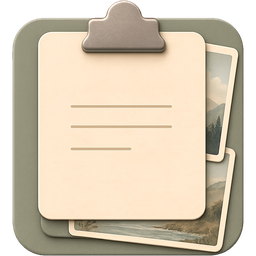
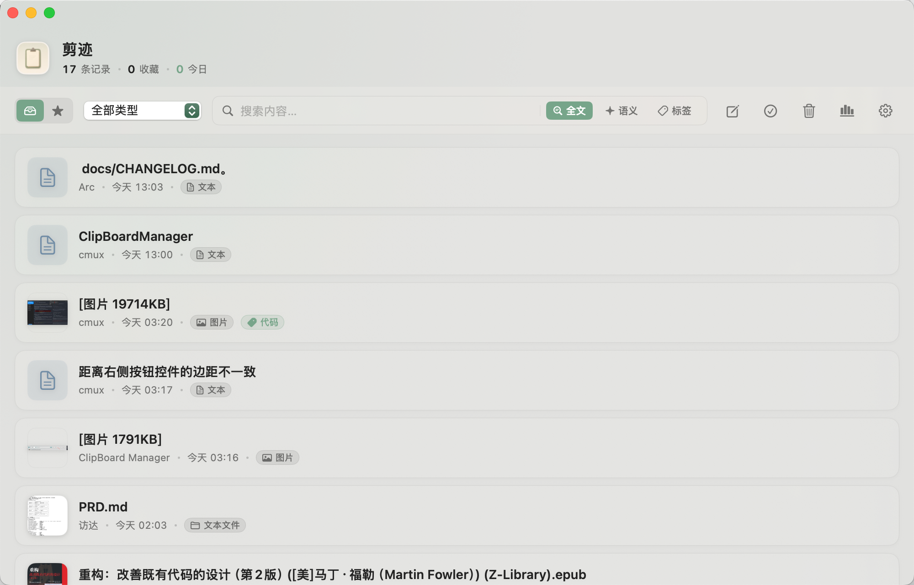
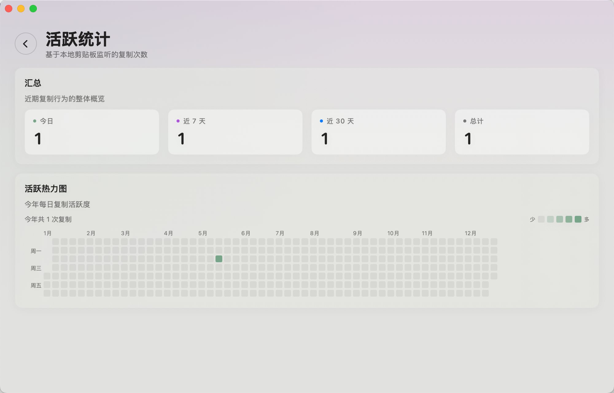
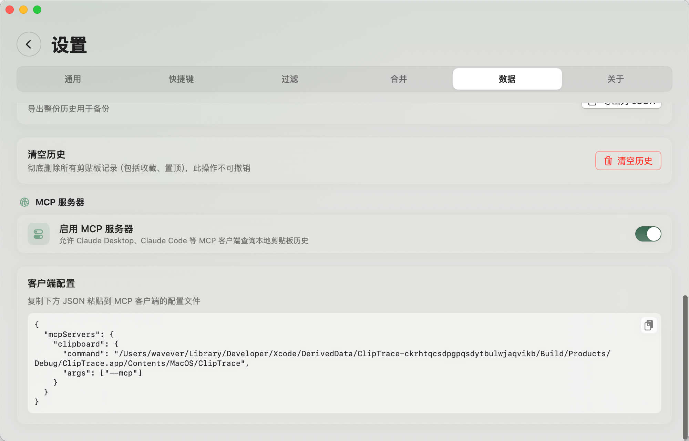

<p align="center">
  
</p>

<h1 align="center">剪迹 / ClipTrace</h1>

<p align="center">
  <a href="README.md">English</a> · <strong>中文</strong>
</p>

<p align="center">
  面向 macOS 与 AI 工具的本地优先剪贴板历史。
</p>

<p align="center">
  <a href="https://wavever.github.io/ClipTrace/"></a>
  <a href="https://github.com/wavever/ClipTrace/actions/workflows/ci.yml"></a>
  <a href="https://github.com/wavever/ClipTrace/releases/latest"></a>
  <a href="LICENSE"></a>
  
</p>

剪迹是一个开源 macOS 剪贴板历史管理工具，内置离线语义搜索和 [Model Context Protocol](https://modelcontextprotocol.io/) 服务器。你可以在本机搜索、整理、复用剪贴板历史，也可以让 Claude Desktop、Claude Code、Cursor 等 AI 客户端在本地查询这些内容，而不需要上传到云端。

## 为什么是剪迹？

- **本地优先**：剪贴板历史、OCR 文本、标签、语义向量都保存在你的 Mac 上。
- **离线语义搜索**：基于 Apple `NLEmbedding`，不依赖云端 embedding API。
- **AI 工作流友好**：应用 binary 可以作为 MCP stdio server，给 AI 客户端提供剪贴板检索和整理工具。
- **原生 macOS 体验**：菜单栏、全局快捷键、快速粘贴、预览、片段、SwiftUI 界面。
- **内容保护**：手机号、API 密钥等敏感内容在界面、导出和 MCP 中默认脱敏展示，原文仍保存在本机供复用。
- **隐私控制**：暂停监听、排除来源 App、忽略敏感 pasteboard marker、剥离 URL 跟踪参数、禁用 MCP 工具、删除历史。

## 预览

<p align="center">
  
  <br/>
  <em>主界面：历史记录、全文与语义搜索、标签</em>
</p>

<p align="center">
  
  <br/>
  <em>活跃统计：每日复制次数与年度热力图</em>
</p>

<p align="center">
  
  <br/>
  <em>MCP 服务器：接入 Claude Desktop、Claude Code 或 Cursor</em>
</p>

## 功能特性

### 捕获与复用

- 自动捕获文字、图片、视频、文件、链接、富文本
- 双击条目即可写回剪贴板
- 重复复制已有内容时自动浮到顶部，不产生重复记录
- 支持粘贴为纯文本、复制时清理末尾空白
- 软删除垃圾桶，可恢复、彻底删除、按保留期自动清理
- 主窗口和片段支持全局快捷键
- 图片以压缩格式 + 外置存储保存，历史再多也能保持较低的内存与磁盘占用
- 支持列表与网格布局切换：主窗口使用自适应网格，快速粘贴与菜单栏面板可在设置中分别启用双列网格；网格图片预览保持原始宽高比，并以浮层显示图片名称

### 搜索与整理

- 全文搜索与类型过滤
- 对文字和 OCR 内容进行离线语义搜索
- 支持 `app:Safari`、`since:2d`、`before:2026-05-01` 等来源和时间过滤
- 收藏、置顶、标签、自定义标题、标签自动补全
- 同类型条目多选合并

### 内容感知

- hover 富预览
- 图片 OCR 入索引
- 自动识别时间戳、Base64、JSON
- 视频缩略图或内联播放器预览
- 自动剥离 `utm_*`、`fbclid`、`gclid` 等 URL 跟踪参数
- 窗口可隐藏于录屏和屏幕共享

### 内容保护

- 自动且保守地脱敏敏感内容：中国大陆手机号（`13812345678` → `138****5678`）以及 API 密钥、令牌、密码——`appkey=…` 等标签形态,加上 `sk-`、`ghp_`、`AKIA` 等高置信前缀
- 只脱敏敏感值本身,保留标签和上下文结构；对 UUID、哈希、时间戳、普通 URL 不误判
- 列表、预览、菜单栏、Dynamic Island、Quick Paste、Quick Look、搜索摘要均展示脱敏内容,受保护条目带锁形徽标
- 本地存储不改写原文——复制、快速粘贴、复制为纯文本、编辑仍使用原始内容
- 默认导出和 MCP 返回脱敏内容并带 `isProtected` 元数据；外发原文需显式开启
- 设置 → 隐私 提供总开关与统一的识别规则列表:内置的手机号 / App Key 规则可编辑、可恢复默认、可停用,也可添加关键词或正则自定义规则

### 导出与统计

- JSON 导出，支持类型、时间、收藏、置顶过滤
- 单条按原始格式导出，例如 text、PNG
- 每日复制次数、14 天柱状图、GitHub 风格年度热力图

## MCP Server

应用 binary 同时可以作为 MCP stdio server。兼容客户端配置示例：

```json
{
  "mcpServers": {
    "clipboard": {
      "command": "/Applications/ClipTrace.app/Contents/MacOS/ClipTrace",
      "args": ["--mcp"]
    }
  }
}
```

可用工具：

| 工具 | 用途 |
|---|---|
| `search_clipboard` | 关键词或语义搜索剪贴板历史 |
| `list_recent` | 列出最近条目，可按类型过滤 |
| `get_clip` | 通过 UUID 获取单条完整内容与元数据 |
| `list_tags` | 列出所有标签和使用次数 |
| `list_recent_activity` | 按 ISO 日期或 `30m`、`2h`、`3d`、`1w` 等相对时间列出最近活动 |
| `tag_clip` / `untag_clip` | 添加或移除标签 |
| `favorite_clip` / `pin_clip` | 更新收藏或置顶状态 |
| `delete_clip` / `restore_clip` | 软删除、彻底删除或恢复条目 |
| `create_snippet` | 创建带标题和标签的片段 |

受保护条目在 MCP 返回中默认脱敏并带 `isProtected` 元数据；返回原文需在 设置 → 隐私 中显式开启。MCP 仍会把其它剪贴板内容暴露给你配置的客户端,敏感工作流启用前建议先阅读 [PRIVACY.md](PRIVACY.md)。

## 安装

从 [GitHub Releases](https://github.com/wavever/ClipTrace/releases/latest) 下载最新 DMG，打开后将 ClipTrace 拖入 Applications。

当前公开版本使用稳定的自签名身份签名，以便 macOS 在更新后保留辅助功能权限。公开 notarization 在路线图中。如果 macOS 拦截下载版本，也可以直接从源码构建。

## 系统要求

- macOS 14.0 Sonoma 或更高版本
- 推荐使用 Xcode 16.0 或更高版本开发

## 从源码构建

用 Xcode 打开 `ClipTrace.xcodeproj`，选择 "My Mac"，点击运行。

命令行构建：

```bash
xcodebuild \
  -project ClipTrace.xcodeproj \
  -scheme ClipTrace \
  -configuration Debug \
  -destination 'platform=macOS' \
  -derivedDataPath build \
  -skipMacroValidation \
  CODE_SIGN_IDENTITY="-" \
  CODE_SIGNING_REQUIRED=NO \
  CODE_SIGNING_ALLOWED=NO \
  build
```

### 维护者代码签名

Release 使用固定的自签名证书，这样 macOS 才能在重新构建和更新后保留辅助功能权限。没有固定签名身份时，权限可能在每次构建后失效。

首次配置：

```bash
scripts/generate-signing-cert.sh
```

脚本会打印 `SIGNING_CERT_P12_BASE64` 和 `SIGNING_CERT_PASSWORD`，用于配置 GitHub Actions secrets。

## 快捷键

| 快捷键 | 功能 |
|---|---|
| `⌘⇧V` | 打开主窗口 |
| `⌘,` | 打开设置 |
| `⌘N` | 新建片段 |
| `⌘⏎` | 保存片段 |
| `Esc` | 关闭预览、返回或取消 |

## 项目文档

- [隐私说明](PRIVACY.md)
- [安全策略](SECURITY.md)
- [贡献指南](CONTRIBUTING.md)
- [路线图](ROADMAP.md)
- [行为准则](CODE_OF_CONDUCT.md)

## 参与贡献

欢迎提交 issue 和 PR。适合起步的方向包括文档、翻译、MCP resources/prompts、URL sanitizer 测试、搜索解析测试、隐私体验优化。

贡献前请阅读 [CONTRIBUTING.md](CONTRIBUTING.md)。涉及私密安全或隐私问题时，请按照 [SECURITY.md](SECURITY.md) 处理，不要在公开 issue 里粘贴敏感剪贴板内容。

## 许可证

剪迹使用 [MIT License](LICENSE) 开源。
